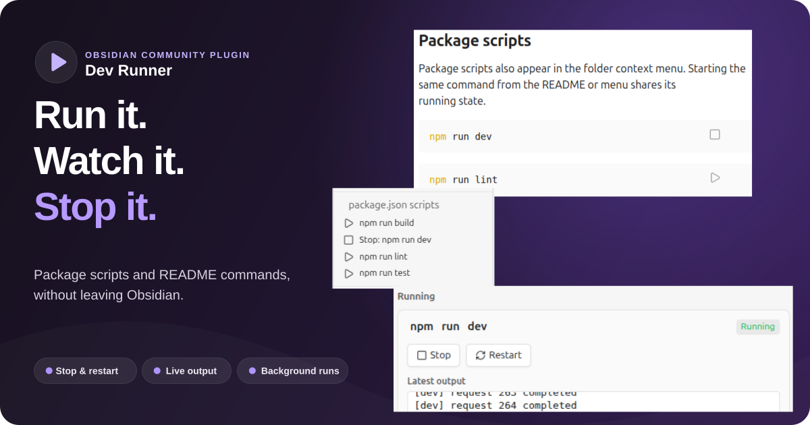
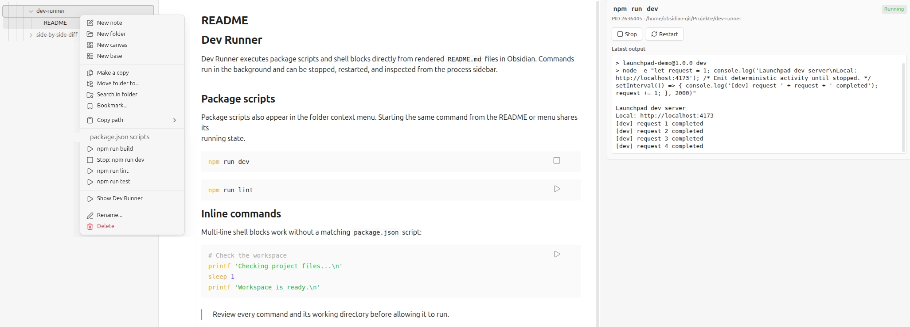

# Dev Runner

[](https://community.obsidian.md/plugins/dev-runner)
[](https://github.com/nblum/obsidian-dev-runner/actions/workflows/ci.yml)
[](https://github.com/nblum/obsidian-dev-runner/releases)
[](LICENSE)
[](https://github.com/nblum/obsidian-dev-runner)



Run package scripts and executable Markdown command blocks directly from Obsidian. Dev Runner keeps each command in
the background, captures its latest output, and provides stop, restart, and session-history controls in a sidebar.

> Start, observe, stop: development commands stay attached to the Obsidian lifecycle instead of opening separate
> terminal windows.

## Contents

- [Features](#features)
- [Quick start](#quick-start)
- [Markdown commands](#markdown-commands)
- [Process sidebar](#process-sidebar)
- [Security](#security)
- [Settings](#settings)
- [Installation](#installation)
- [Feedback and support](#feedback-and-support)
- [Development](#development)
- [Releases](#releases)

## Features

- discovers `package.json` scripts from a folder context menu
- detects npm, pnpm, Yarn, or Bun from `packageManager` and lockfiles
- adds Play buttons to shell code blocks in enabled Markdown files
- starts commands without opening a terminal window
- captures a bounded tail of combined standard output and standard error
- prevents the same command and working directory from running twice across package menus and Markdown buttons
- stops complete process trees and restarts commands with their original working directory
- retains the 50 most recent completed, failed, and stopped runs for the current plugin session
- provides a German and English interface with automatic Obsidian-language detection
- warns before executing untrusted commands and supports fingerprinted command approvals
- terminates active processes when the plugin unloads or Obsidian closes normally

Dev Runner supports Obsidian desktop on Windows, macOS, and Linux. It is desktop-only because it uses the local
filesystem and Node.js child processes.

## Quick start

1. Enable **Dev Runner** under **Settings → Community plugins**.
2. Right-click a vault folder that contains `package.json`.
3. Select a command below **package.json scripts**.
4. Confirm the security warning after reviewing the command and working directory.
5. Open **Dev Runner** from the Play ribbon icon, command palette, or folder menu.

The package script runs with the selected folder as its working directory. Selecting its active folder-menu entry
stops the complete process tree.





## Markdown commands

Rendered shell blocks in files named `README.md` receive a Play button automatically. Other Markdown files can opt in
with boolean frontmatter; the **Enable commands in all Markdown files** setting enables them globally and is off by
default:

```yaml
---
dev-runner: true
---
```

Obsidian text properties that serialize this value as `dev-runner: "true"` are supported as well.

Supported fence languages are `bash`, `sh`, `shell`, and `zsh`:

```bash
npm install
npm run dev
```

The complete block runs through the platform shell with the Markdown file's directory as its working directory.
Enabled files open in reading mode by default so the buttons are immediately available; this behavior can be disabled
in the settings, and editing mode remains available through Obsidian.

A plain Markdown command such as `npm run dev` shares its active state with the equivalent package-menu action in the
same directory. Starting it from either place changes both surfaces to Stop, and either Stop action terminates the
shared process. Compound or multi-line shell blocks retain their own identity because their execution semantics differ.

## Process sidebar

The sidebar groups entries into active processes and a 50-entry session history. Each entry shows its status, process ID,
working directory, and up to 12,000 characters of recent output. Active processes can be stopped or restarted;
finished entries can be restarted after the source command has been revalidated.

History is intentionally in-memory. Reloading the plugin or closing Obsidian clears finished entries and stops active
processes; a reloaded plugin waits for the previous instance's shutdown attempt before accepting new commands.

## Security

Package scripts and shell blocks can execute arbitrary code with the permissions of the Obsidian process. They can
modify files, access the network, start child processes, and read inherited environment variables.

To discover and verify commands, Dev Runner directly reads `package.json`, supported lockfiles, and enabled Markdown
files inside the selected vault directory. On Linux it additionally reads `/proc/<pid>/stat` to verify that a process
ID still belongs to the process group started by the plugin before sending a stop signal. The plugin does not use
direct filesystem APIs to write project files.

Dev Runner therefore displays the exact command and working directory before an untrusted command starts. An optional
approval is bound to the command, directory, execution environment, and relevant project files. Changing one of these
inputs invalidates the approval. Saved approvals can be reset in the plugin settings.

The warning is not a sandbox. Disabling security warnings is supported for controlled environments but is not
recommended and is off by default.

## Settings

| Setting | Default | Effect |
| --- | --- | --- |
| Language | Automatic | Uses German for German Obsidian locales and English otherwise; both can be selected explicitly. |
| Package manager | Automatic | Detects the package manager from project metadata and lockfiles. |
| Open process sidebar on interactions | On | Opens the sidebar after start, stop, and restart actions. |
| Open enabled Markdown files in reading mode | On | Makes rendered command buttons available when an enabled file is opened. |
| Enable commands in all Markdown files | Off | Adds command controls globally; otherwise `README.md` and files with `dev-runner: true` are enabled. |
| Disable security warnings | Off | Executes commands without the confirmation dialog. |
| Saved command approvals | Empty | Resets all remembered command fingerprints. |

The About section at the top links to the developer website, the GitHub repository for stars, and the issue page for
feedback.

## Installation

Dev Runner requires Obsidian `1.8.7` or later.

Use the **Add to Obsidian** button above to open the Dev Runner community plugin page. To install the plugin, search
for `Dev Runner` under **Settings → Community plugins → Browse** in Obsidian.

For local development, place this repository at `.obsidian/plugins/dev-runner/`, install dependencies, and build the
bundle:

```bash
npm install
npm run build
```

Then reload Obsidian and enable **Dev Runner**. A release installation consists of `main.js`, `manifest.json`, and
`styles.css`.

## Feedback and support

- [Report a bug or request a feature](https://github.com/nblum/obsidian-dev-runner/issues/new)
- [View releases](https://github.com/nblum/obsidian-dev-runner/releases)
- [Read the changelog](CHANGELOG.md)
- [Visit the developer website](https://blum-nico.de)

If Dev Runner is useful to you, a [GitHub star](https://github.com/nblum/obsidian-dev-runner) is much appreciated.

## Development

```bash
npm install
npm run dev
npm run validate:manifest
npm run typecheck
npm run lint
npm test
npm run build
```

Source modules live in `src/`, translations in `locales/`, deterministic unit tests in `tests/`, and release automation in `.github/workflows/`.
The generated `main.js`, installed dependencies, IDE metadata, and local `data.json` settings are ignored by Git.

See [FEATURES.md](FEATURES.md) for the authoritative feature scope and [CONTRIBUTING.md](CONTRIBUTING.md) for the
development checklist.

## Releases

Add notes below `## [Unreleased]` in `CHANGELOG.md`, commit and synchronize all pending work, then run
`npm run release -- <x.y.z>`. The task synchronizes release metadata, runs all checks, commits, tags, and atomically
pushes the branch and tag. The tag workflow builds and publishes the three required assets with artifact attestations.
